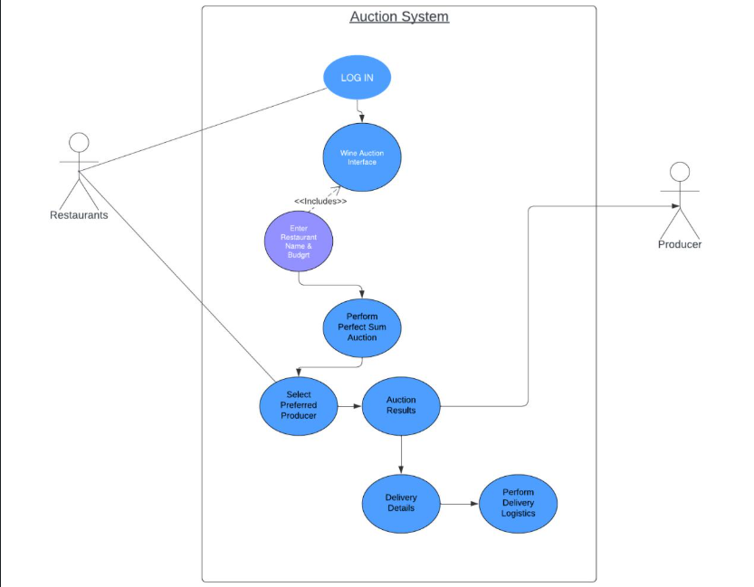

# 🍷 Wine Auction System — Global Wine Trading Platform

**University of the Western Cape — Big Data Engineering**

A global wine trading platform that connects South African wine producers with high-demand restaurants worldwide. The system uses big data pipelines, real-time APIs, and an intelligent auction algorithm to modernize the wine supply chain through dynamic pricing and optimized logistics.



---

## 📖 Overview

Traditional wine supply chains are slow, manual, and inefficient at matching producer supply with restaurant demand across borders. This project reimagines that process as a real-time, data-driven marketplace:

- Restaurants submit their wine requirements and budget.
- A **perfect-sum multi-unit auction algorithm** matches them against producer inventory in real time.
- The winning trades are automatically routed through an air + road logistics pipeline that accounts for live traffic and weather, guaranteeing delivery before the restaurant opens.

**Impact (project targets/estimates):**
- ⏱️ ~30% reduction in wine delivery lead times
- 💰 ~15% average logistics cost savings
- ⚡ Auction bid matching and results returned in under 5 seconds via Kafka streaming
- 📈 Designed to support 100,000+ daily transactions

---

## 🏗️ System Architecture

**Data Collection**
- Restaurant data gathered via web scraping (`BeautifulSoup`, `Selenium`)
- Producer and regional wine data sourced and structured for South African producers
- Data persisted in **Hadoop HDFS** for scalable, fast access

**Real-Time APIs**
- **Amadeus API** — flight schedules and pricing for air freight legs
- **TomTom API** — live traffic and road routing
- **OpenWeatherMap API** — weather delay prediction and rerouting triggers

**Auction Engine**
- Perfect-sum multi-unit auction algorithm implemented in **PySpark**
- Bid submission and results streamed via **Apache Kafka**, matching supply and demand on budget, wine type, and quantity in under 5 seconds

**Logistics Optimization**
- Combines air and road transport data into a single route plan
- Dynamically reroutes shipments in response to live traffic or weather disruptions
- Targets delivery at least one hour before restaurant opening hours

---

## 🖥️ Walkthrough

### 1. Use Case Diagram
The overall flow: a restaurant logs in, enters its name and budget, the system runs the perfect-sum auction, the restaurant selects a preferred producer from the results, and delivery logistics are triggered.


### 2. Delivery Analysis — Entry Point
Restaurants start here, entering their name and a custom budget to kick off the auction search.


### 3. Wine Trade / Auction Results
The perfect-sum auction engine returns matched producers against the restaurant's budget, broken down by wine type, quantity, cost, and remaining budget.


### 4. Delivery Details
Once a producer is selected, the platform surfaces structured producer and restaurant details — coordinates, nearest airports, wine type, quantity, and total cost — ready for logistics planning.


### 5. Optimized Delivery Route
The logistics module stitches together ground transport, a flight leg, and final-mile ground transport, with live distance, travel time, and traffic delay for each segment.


### 6. Flight API Integration
Real flight options are pulled from the Amadeus API, including pricing, schedule, aircraft type, and cabin class, to select the fastest viable leg.


---

## 📂 Repository Structure

```
Wine-Auction-System/
├── README.md
├── scarp.py                    # Web scraping (BeautifulSoup/Selenium) for restaurant data
├── resturants.csv              # Scraped restaurant dataset
├── south_african_data.py       # South African wine producer data collection/processing
├── wine_producers.csv          # Wine producer dataset
├── cons.py                     # Perfect-sum multi-unit auction / constraint logic
├── flight.py                   # Amadeus API integration for flight schedules & pricing
├── flight_results.html         # Sample flight search output
├── road.py                     # TomTom API integration for routing & traffic
└── route_..._Restaurant.html   # Sample generated delivery route map
```

> Update the descriptions above with the exact responsibilities of each script — the short summaries here are inferred from filenames and should be tightened based on the actual implementation.

---

## 🛠️ Tech Stack

| Layer | Technology |
|---|---|
| Data Storage | Hadoop HDFS |
| Stream Processing | Apache Kafka |
| Batch/Distributed Compute | PySpark |
| Web Scraping | BeautifulSoup, Selenium |
| Flight Data | Amadeus API |
| Routing & Traffic | TomTom API |
| Weather | OpenWeatherMap API |
| Language | Python |

---

## 🚀 Getting Started

```bash
# Clone the repository
git clone https://github.com/<your-username>/Wine-Auction-System.git
cd Wine-Auction-System

# Install dependencies
pip install -r requirements.txt
```

> Add a `requirements.txt` (e.g. `pyspark`, `kafka-python`, `beautifulsoup4`, `selenium`, `requests`, `pandas`) so the setup steps above actually run for anyone cloning the repo.

**Environment variables / API keys needed:**
- `AMADEUS_API_KEY` / `AMADEUS_API_SECRET`
- `TOMTOM_API_KEY`
- `OPENWEATHERMAP_API_KEY`

---

## 👥 Contributors

Built as a team project for the Big Data Engineering module at the University of the Western Cape.

---

## 📄 License

Add a license (e.g. MIT) if you'd like others to be able to reuse this code.
